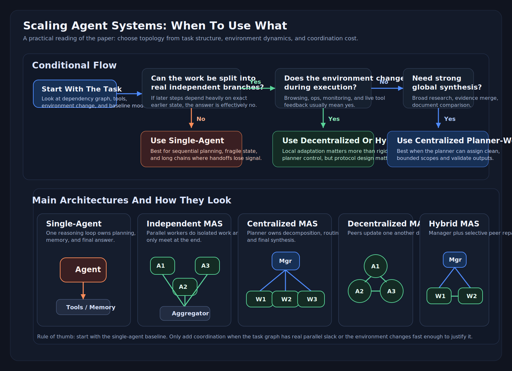

# Towards a Science of Scaling Agent Systems

**Authors:** Yubin Kim et al.
**Published:** arXiv, 2025
**Link:** https://www.alphaxiv.org/abs/2512.08296
**Tags:** agents

## TL;DR
- agent-system performance scales with the interaction between task structure, coordination topology, tool density, and base model capability, not just with the number of agents.
- basically, this paper studies when single-agent vs multi-agent llm systems perform best and argues agent scaling depends on task structure, coordination topology, tool density, and base model capability rather than simple agent count.

## Problem
Multi-agent systems are often designed with heuristics like "more specialized agents are better", but in practice coordination overhead, duplicated work, and error propagation can outweigh the benefits. The paper tries to turn agent architecture selection into a measurable systems problem.

## Core Idea
The paper evaluates five canonical agent architectures across multiple benchmarks and model families under controlled settings. Instead of treating all multi-agent systems as equivalent, it frames performance as the interaction between the number of agents, the coordination structure, the capability of the underlying model, and the properties of the task.

Its main claim is that agentic scaling behaves like a systems tradeoff, not a monotonic law. Parallelizable tasks benefit from decomposition and coordination, while sequential tasks pay a heavy coordination tax. The paper then proposes measurable coordination metrics such as efficiency, overhead, redundancy, and error amplification to explain these outcomes and build a predictive model for architecture choice.

## Key Findings
- Centralized systems perform best on highly decomposable tasks.
- Decentralized systems can outperform centralized systems in dynamic environments.
- Sequential tasks are penalized by handoffs and coordination overhead.
- Capability saturation reduces the gains from extra agents once the single-agent baseline is already competitive.
- Multi-agent systems degrade performance on tightly sequential reasoning tasks, especially with independent agents without any controlled orchestration.
- Independent agents have the worst error amplification because they lack intermediate validation.
- Tool-heavy settings increase coordination tax disproportionately.
- Better base models reduce the marginal value of extra coordination once the single-agent baseline is already strong.

## Architecture / Method
Five evaluated architectures:

1. Single-Agent System (SAS)
2. Independent MAS
3. Centralized MAS
4. Decentralized MAS
5. Hybrid MAS

The paper evaluates them on **Finance-Agent, BrowseComp-Plus, PlanCraft, and Workbench** across three LLM families and 180 total configurations.

This visual is the practical version of the paper's claim. The top half is a decision flow for choosing a topology. The bottom half shows the shape of each architecture so you can reason about where coordination cost and failure propagation enter the system.

## Notes

### Why this paper matters
i think the question is no longer "should we use sub-agents?" but "what kind of task graph are we executing, and what coordination tax are we willing to pay?"

### Operational interpretation of the five architectures

#### 1. Single-Agent System
One agent owns the whole loop: planning, tool use, state updates, and final answer generation. This preserves coherence across steps and avoids handoff loss, but it gives up parallelism and specialization.

#### 2. Independent Multi-Agent System
Several agents work in parallel with no communication until aggregation. This maximizes concurrency and minimizes coordination logic, but it also maximizes duplicated work and makes it hard to correct local mistakes before they reach the final answer.

#### 3. Centralized Multi-Agent System
A coordinator decomposes tasks, assigns them to workers, and synthesizes outputs. This is closest to planner-worker or orchestrator-subagent designs used in many real systems. It introduces a bottleneck but provides a natural place for validation and budget control.

#### 4. Decentralized Multi-Agent System
Agents communicate directly and iteratively, usually sharing observations or debating local interpretations. This can work better than centralized control in environments where adaptation matters more than rigid planning, but message complexity rises quickly.

#### 5. Hybrid Multi-Agent System
Hybrid combines top-down assignment with selective peer-to-peer interaction. Intuitively, it tries to keep the benefits of a manager while allowing local recovery among workers.

### Three scaling principles to track

#### Alignment principle
Parallelizable tasks benefit when architecture matches task decomposition. Centralized systems can split work cleanly and get real gains because the workers do useful non-overlapping work.

#### Sequential penalty
When the task is serial and tightly coupled, handoffs become reasoning loss. The system spends tokens coordinating instead of thinking, and each transfer compresses or distorts the state.

#### Tool-coordination tradeoff
As the tool surface grows, the cost of deciding who should use what and when grows too. Multi-agent systems can drown in routing and context-management overhead before they extract any value from specialization.

### Mapping to practical agent engineering
- **Planner-worker** maps most closely to `centralized MAS`.
- Parallel sub-agents with final merge map to independent MAS.
- Debate or swarm-style systems map to decentralized MAS.
- Runtime task routing plus local worker collaboration maps to hybrid MAS.

### Benchmark-by-benchmark interpretation

#### 1. Finance-Agent
This benchmark appears to be the clearest win case for multi-agent coordination. The task structure is relatively decomposable: gather relevant information, analyze multiple aspects in parallel, and synthesize the result. That is exactly where centralized orchestration should help because the planner can split by subquestion or evidence source, then merge outputs.

Why centralized wins here:
- subproblems are separable enough that workers can make real progress independently
- the orchestrator can reduce duplicated exploration
- synthesis is important, but it happens after useful parallel work has already been done

**takeaway:**
- closest analog to research/report generation, due diligence, or structured investigation agents. If your workflow naturally decomposes into independent evidence-gathering branches with a final synthesis pass, planner-worker is justified.

#### 2. BrowseComp-Plus
This benchmark represents dynamic web navigation or browsing-style tasks. The environment changes as the agent explores pages, follows links, and updates its understanding of what matters. The paper's result that decentralized coordination performs better here is plausible because rigid top-down decomposition can become stale quickly once the environment reveals new information.

Why decentralized can help:
- workers can react locally to newly discovered information
- peer-to-peer sharing is sometimes cheaper than round-tripping through a planner
- the value comes from adaptation, not just static decomposition

**takeaway:**
This maps to browser agents, ops triage flows, and exploratory tool-use systems. If the world state evolves during execution, over-centralized planners become a bottleneck and can issue obsolete instructions.

#### 3. PlanCraft
This is the paper's main example of a sequential, tightly coupled task where multi-agent systems degrade. The core difficulty is not breadth but dependency structure: each next step depends strongly on the correctness of the previous one. In that regime, handoffs lose too much state and force agents to summarize reasoning that should have remained continuous.

Why MAS loses here:
- each decomposition boundary is a lossy compression step
- workers cannot truly operate independently because later work depends on earlier details
- coordination consumes budget without creating real parallel slack

**takeaway:**
Planning-heavy agentic workflows often look decomposable from the outside but are actually serial under the hood. If the plan is fragile and intermediate details matter, one strong agent with persistent context is often better than multiple specialized workers.

#### 4. Workbench
This benchmark looks like a mixed-complexity environment with tools, multi-step workflows, and more realistic execution demands. The paper uses it to expose how tool density and coordination complexity interact. The lesson is not only about task decomposition, but also about action-routing cost.

Why this benchmark matters:
- it approximates production agents more than clean academic tasks do
- it stresses artifact passing, tool selection, and state tracking
- it shows that coordination overhead grows with action-space complexity

**takeaway:**
If your system has lots of tools, retrieval channels, mutable state, and cross-agent artifacts, you should assume the overhead term grows faster than intuition suggests. This is where elegant architecture diagrams often collapse under operational bookkeeping.

### practical guide

#### When to stay single-agent
Use a single agent when the task is mostly serial, when correctness depends on subtle intermediate state, or when tool usage is tightly coupled to evolving reasoning. This includes long planning chains, code modification tasks with fragile context, and workflows where intermediate artifacts are hard to formalize cleanly.

- If the task cannot be cleanly split into independent branches with well-defined contracts, default to single-agent plus tools and maybe an evaluator pass.

#### When to use planner-worker
Use centralized MAS when the task decomposes into meaningful, bounded subtasks and the final answer benefits from structured synthesis. This is the best fit for parallel research, evidence gathering, document comparison, broad investigation, and sometimes multi-file codebase exploration.

What the planner must own:
- task decomposition
- budget allocation
- duplicate-work suppression
- output validation before final merge

Without those controls, planner-worker collapses into expensive independent agents.

#### When decentralization is justified
Use decentralized or partially decentralized systems only when local adaptation matters enough to outweigh messaging cost. This is more likely in browsing, monitoring, incident response, or environments where workers encounter new observations that should immediately influence peers.

- Decentralization is not a free intelligence boost. It trades central bottlenecks for protocol complexity. If you do not define what can be shared, when, and in what format, you get conversational noise rather than collaboration.

#### Why independent sub-agents are risky
Independent workers plus a final merge is often the easiest system to build, but the paper suggests it is one of the least reliable when correctness matters. It encourages duplicate work, inconsistent assumptions, and late-stage reconciliation of incompatible outputs.

- If you spawn parallel agents, give them either disjoint scopes or an intermediate validation step. Otherwise you are building a high-throughput error amplifier.

#### Capability saturation and model choice
One of the strongest practical messages in the paper is that stronger base models reduce the marginal gain from coordination. If a capable single agent already solves a large fraction of the task, extra topology often adds cost faster than value.

Use this as a decision rule:
- weak base model plus decomposable task: coordination may help
- strong base model plus sequential task: coordination likely hurts
- strong base model plus decomposable task: coordination must justify itself on latency, cost, or reliability grounds

#### What to measure in your own systems
If you want to apply the paper at work, instrument the following:
- handoff count per successful task
- token spend on coordination vs task work
- duplicate tool calls across agents
- stale-plan rate after environment changes
- failure propagation from one bad sub-agent output to final answer
- single-agent baseline quality before any orchestration is added

These metrics are more actionable than vague claims like "the multi-agent version feels smarter."

### Coordination metrics: the real contribution

The paper becomes much more useful once you stop reading it as an architecture bake-off and start reading it as a measurement framework. The key variables are not just task success and agent count, but the hidden coordination terms that determine whether a topology is actually buying useful work.

#### 1. Efficiency
Efficiency is the amount of useful task progress created per unit of system activity. In practice, this means asking whether additional agents are producing non-overlapping, high-value work or just increasing motion in the system.

Operationally, efficiency goes up when:
- subtasks are genuinely independent
- workers have clear scopes
- the merge step uses most of what workers produced

Efficiency goes down when:
- multiple agents rediscover the same information
- planners over-decompose trivial work
- agents spend more time coordinating than advancing the task

Production proxy metrics:
- fraction of sub-agent outputs that are actually used in the final answer
- useful tool calls divided by total tool calls
- elapsed task progress per extra token spent on orchestration

#### 2. Overhead
Overhead is the cost of making the system collaborative at all. This includes planning messages, routing decisions, artifact serialization, memory synchronization, retries, and merge steps.

In real systems, overhead is usually underestimated because it is dispersed:
- planner prompts
- schema conversions
- sub-agent bootstrapping context
- evaluator passes
- retry-and-repair loops

Production proxy metrics:
- tokens spent on coordination prompts versus task prompts
- latency added by orchestration layers
- number of handoffs per successful task
- number of schema or artifact transformations in the execution path

#### 3. Redundancy
Redundancy is duplicated work across agents. Some redundancy is useful when you want robustness or diverse exploration, but beyond a small amount it becomes waste.

Redundancy usually appears as:
- multiple agents calling the same tool with near-identical inputs
- parallel web explorers visiting overlapping sources
- several workers independently reconstructing the same context

Production proxy metrics:
- duplicate tool invocations
- overlap in citations, URLs, files, or records touched by different agents
- repeated retrieval queries with near-identical intent

#### 4. Error Amplification
This is the most important metric from a reliability perspective. Error amplification measures how much one local mistake spreads and compounds through the system. A bad decomposition, stale observation, or incorrect intermediate artifact can corrupt downstream steps and produce a confidently wrong final answer.

Common amplification patterns:
- planner assigns the wrong subproblem and all workers optimize the wrong objective
- one sub-agent writes a flawed artifact that later agents treat as truth
- aggregator merges inconsistent outputs without enough context to detect conflict

Production proxy metrics:
- final-task failure rate conditioned on one earlier sub-agent failure
- number of downstream actions taken from an incorrect intermediate artifact
- rate of inconsistency detected only at the final aggregation stage

### How to think about these metrics together

The architecture decision is basically a balance equation:

- multi-agent is attractive when added efficiency exceeds added overhead and error amplification remains controlled
- single-agent is attractive when coordination overhead dominates or when sequential coherence matters more than parallel exploration

That is the paper's deepest engineering point. The topology is not the primitive. The primitive is the net value of coordination under a given task structure.

### Stress test: what breaks without each component

#### Component: Central orchestrator
What it does:
Decomposes work, allocates budget, enforces scopes, and synthesizes outputs.

What breaks without it:
You lose global task allocation. Workers either overlap heavily or drift into incompatible local objectives. Final synthesis becomes guesswork because nobody owns the global contract.

Why this solution:
A planner is the simplest way to impose structure on decomposable tasks and suppress redundant work.

Tradeoff:
The orchestrator becomes a bottleneck and a single point of architectural failure. If it decomposes poorly, the whole system is wrong in a highly organized way.

#### Component: Worker specialization
What it does:
Lets different agents focus on bounded scopes, tools, or evidence channels.

What breaks without it:
You lose the main reason to pay for multi-agent coordination in the first place. Without specialization, extra agents mostly duplicate general reasoning with slightly different prompts.

Why this solution:
Specialization creates the possibility of real parallel slack and context compression.

Tradeoff:
Specialization only works if interfaces are crisp. Otherwise you get boundary disputes, brittle contracts, and frequent rework.

#### Component: Shared artifacts or memory objects
What it does:
Preserves intermediate state across agents so later steps do not have to reconstruct everything from scratch.

What breaks without it:
Each handoff becomes an implicit summarization problem. Important details disappear, assumptions diverge, and downstream agents act on partial or stale state.

Why this solution:
Structured artifacts reduce ambiguity and make cross-agent contracts inspectable.

Tradeoff:
Shared state introduces synchronization cost, versioning problems, and stale-read bugs. Bad shared memory can be worse than no shared memory because it creates false confidence.

#### Component: Peer-to-peer communication
What it does:
Allows agents to update one another directly in dynamic settings.

What breaks without it:
Agents cannot rapidly adapt to new local discoveries. In exploratory or changing environments, a rigid planner may become outdated before workers finish.

Why this solution:
Direct communication can reduce planner bottlenecks and improve local responsiveness.

Tradeoff:
Message complexity grows fast. Without strict rules, agents generate noise, loops, and socially reinforced mistakes.

#### Component: Final aggregation or validation
What it does:
Checks consistency, resolves conflicts, and turns sub-results into a coherent output.

What breaks without it:
The system returns conflicting partial truths, misses cross-branch inconsistencies, and exposes raw disagreement to the user as if it were final reasoning.

Why this solution:
Aggregation is the place where local progress becomes global correctness.

Tradeoff:
Aggregation can become shallow if the aggregator lacks enough context to truly arbitrate conflicts. In weak systems it becomes formatting, not reasoning.

## Follow-Up Readings
1. More Agents Is All You Need — scaling-positive result to contrast against this paper.
2. Collaborative Scaling for LLM Agents — useful for collective reasoning comparisons.
